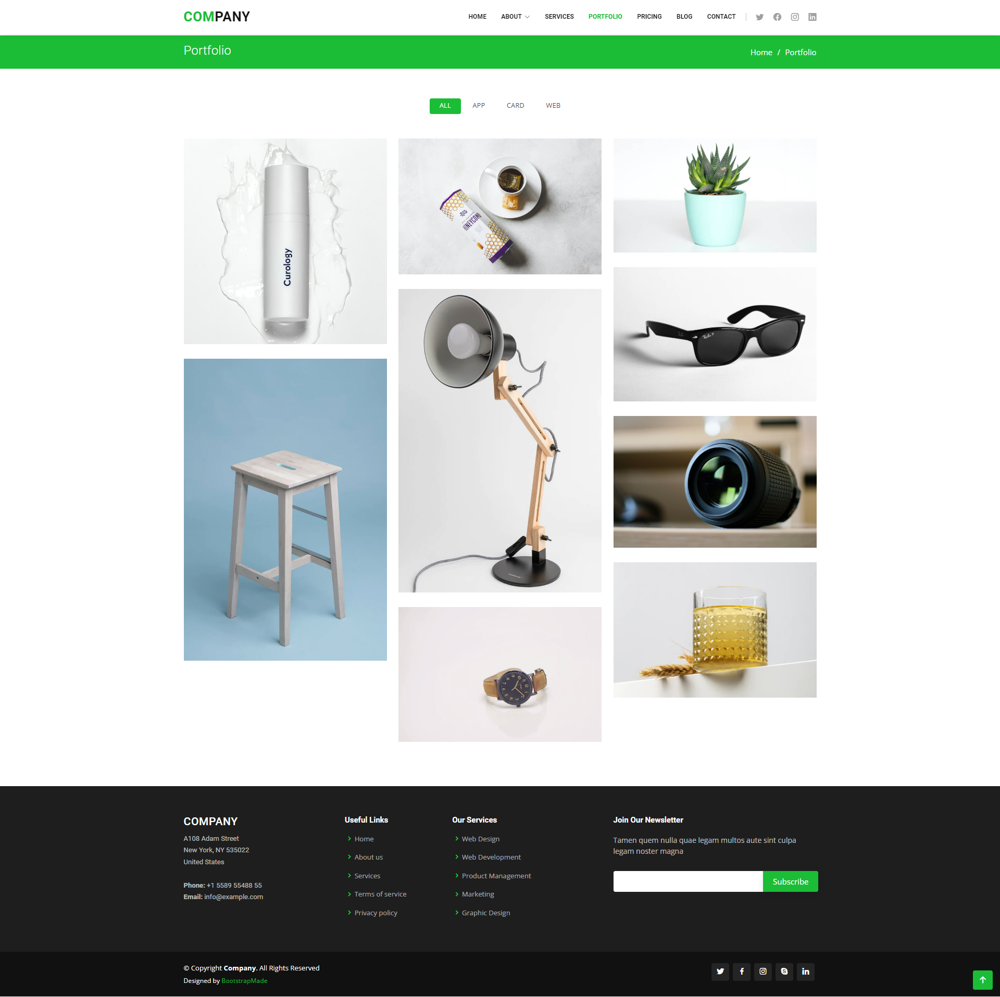

# Company Website Website

<p>
   This company website serves as a communication medium between a company and external parties such as clients, readers, or other users. 
</p>
<p>
	This kind of directory aims to provide specific information about the company's brand, such as its vision, mission, values, products or services, and even historical background.
</p> 

# Preview


# Features

<h4>Client Pages</h4>
<ol type="1">
	<li>
		Authentication
		<ol type="1">
			<li>Login</li>
			<li>Register</li>
			<li>Forgot Password</li>
			<li>Reset Password</li>
		</ol>
	</li>
	<li>
		Account Management
		<ol type="1">
			<li>Change Password</li>
			<li>Manage Profile</li>
		</ol>
	</li>
	<li>
		General Page
		<ol type="1">
			<li>Home</li>
			<li>About</li>
			<li>Service</li>
			<li>Portfolio</li>
			<li>Article</li>
			<li>FAQ</li>
			<li>Contact</li>
		</ol>
	</li>
</ol>

<h4>Admin Pages</h4>
<ol type="1">
	<li>
		Authentication
		<ol type="1">
			<li>Login</li>
			<li>Forgot Password</li>
			<li>Reset Password</li>
		</ol>
	</li>
	<li>
		Account Management
		<ol type="1">
			<li>Change Password</li>
			<li>Manage Profile</li>
		</ol>
	</li>
	<li>
		Content Management
		<ol type="1">
			<li>Dashboard</li>
			<li>About</li>
			<li>Service</li>
			<li>Portfolio</li>
			<li>Article</li>
			<li>FAQ</li>
			<li>Contact</li>
			<li>And Others</li>
		</ol>
	</li>
</ol>


# Technologies Used

<ol type="1">
	<li>Visual Studio Code</li>
	<li>Modern Web Browser</li>
	<li>Git 2.4</li>
	<li>
		Backend Technologies
		<ol type="1">
			<li>MySQL 5.7 / Maria DB 11.3</li>
			<li>PHP 8.3</li>
			<li>Composer 2.7</li>
			<li>Lumen 10 for REST API </li>
		</ol>
	</li>
	<li>
		Frontend Technologies
		<ol type="1">
			<li>Admin LTE</li>
			<li>CSS3</li>
			<li>HTML5</li>
			<li>Bootstrap 5</li>
			<li>Node JS 20</li>
			<li>Vue 3</li>
		</ol>
	</li>
</ol>

## Getting Started
#### 1. Clone the repository and navigate to the directory
```shell
git clone https://github.com/sandyclockup/company-website.git
cd company-website
```

#### 2. Install backend dependencies, please move to directory company-website/backend
```shell
composer install
```

#### 3. Make a .env file and customize its settings 
```shell
DB_CONNECTION=mysql
DB_HOST=localhost
DB_PORT=3306
DB_DATABASE=
DB_USERNAME=
DB_PASSWORD=
```

#### 4. Start MySQL / Maria DB Service , Seed data and Running REST API
```shell
sudo service mysqld start / sudo systemctl start mariadb
CREATE DATABASE {database-name}
php artisan migrate
php artisan db:seed
php artisan jwt:secret
php -S 0.0.0.0:5000 -t public
```

#### 5. Install frontend dependencies, please move to directory company-website/frontend
```shell
npm install
```

#### 6. Make a .env.local file and customize its settings 
```shell
VUE_APP_TITLE="My Website"
VUE_APP_AUTHOR="John Doe"
VUE_APP_DESCRIPTION="Lorem Ipsum is simply dummy text of the printing and typesetting industry. Lorem Ipsum has been the industry's standard dummy text ever since the 1500s, when an unknown printer took a galley of type and scrambled it to make a type specimen book."
VUE_APP_BACKEND_URL="http://localhost:5000"
```

#### 7. Run Application 
```shell
cd frontend/<page> # frontend to client page frontend/client or admin page frontend/admin
npm run serve
```

#### 8. Access application by entering [https://localhost:8000](https://localhost:8000) for client pages or [https://localhost:8080](https://localhost:8080) for admin pages in the browser. 
 
<p>
   for admin user please login with, username : <strong>admin</strong> and password : <strong>secret1234567890</strong>
</p>

<br/>

<br/>

<br/>

</br>

<br/>

<br/>


#### 9. Developer Contact
<ul>
	<li>
		<strong>Linked In</strong> <a target="_blank" href="https://www.linkedin.com/in/sand404/">https://www.linkedin.com/in/sand404/</a>
	</li>
	<li>
		<strong>Facebook</strong> <a target="_blank" href="https://www.facebook.com/sandyandryantz">https://www.facebook.com/sandyandryantz</a>
	</li>
	<li>
		<strong>Instagram</strong> <a target="_blank" href="https://www.instagram.com/sandyandryanto/">https://www.instagram.com/sandyandryanto/</a>
	</li>
	<li>
		<strong>Telegram</strong> <a target="_blank" href="https://t.me/sand404">https://t.me/sand404</a>
	</li>
	<li>
		<strong>Gmail</strong> <a  href="mailto:sandy.andryanto.dev@gmail.com">sandy.andryanto.dev@gmail.com</a>
	</li>
</ul>